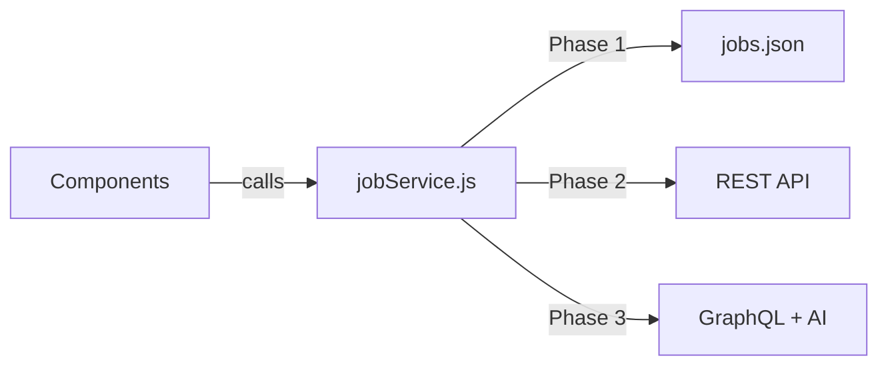
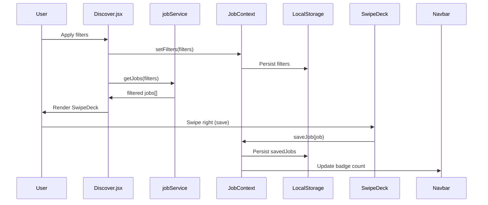

# Swipe2Hire — Architecture & Development Plan

## Project Overview

**Swipe2Hire** is a job discovery platform that modernizes job searching through a swipe-based interface, similar to popular dating apps. The current implementation is a **frontend-focused, production-level UI** built to easily scale for backend APIs and AI-powered features in future phases.

### Core Vision

- **Phase 1 (Current)**: Frontend-first UI with mock data, localStorage persistence
- **Phase 2**: Backend API integration (REST/GraphQL)
- **Phase 3**: AI-powered job matching and recommendations

---

## Technology Stack

| Layer | Technology | Version |
|-------|------------|---------|
| Framework | React (Vite) | ^18.3.1 |
| Styling | TailwindCSS | ^3.4.3 |
| Animations | Framer Motion | ^11.0.0 |
| Routing | React Router | ^6.22.3 |
| State Management | React Context + useReducer | Built-in |
| Persistence | LocalStorage | Browser API |
| Deployment | Vercel | — |
| Icons | Lucide React | ^0.378.0 |

---

## Project Structure

```
src/
├── App.jsx              # Root component with routing & providers
├── main.jsx             # Entry point with BrowserRouter
├── components/          # Reusable UI components
│   ├── EmptyState.jsx       # Empty state displays (no-jobs, deck-empty, no-saved)
│   ├── FilterPanel.jsx     # Slide-in filter drawer with active chips
│   ├── JobCard.jsx         # Job display card (swipe/list variants)
│   ├── Navbar.jsx          # Global navigation (hides on Home)
│   ├── PageTransition.jsx  # Page-level enter/exit animations
│   └── SwipeDeck.jsx       # Core swipe card stack component
├── pages/               # Route-level page components
│   ├── Home.jsx            # Landing page with hero & features
│   ├── Discover.jsx        # Main swipe discovery interface
│   └── SavedJobs.jsx       # Saved/bookmarked jobs list
├── services/           # Data abstraction layer
│   └── jobService.js       # All data fetching (currently mock → future API)
├── store/              # Global state management
│   └── JobContext.jsx      # React Context with useReducer
├── data/               # Static/mock data
│   └── jobs.json          # Sample job listings (50+ entries)
├── utils/              # Helper functions
│   ├── formatDate.js      # Relative date formatting
│   └── formatSalary.js    # Salary display formatting
└── styles/
    └── globals.css        # Tailwind directives & custom components
```

---

## Architecture Principles

### 1. Data Abstraction (Service Layer)

**Rule**: The UI must never directly load data.

All data access goes through [`jobService.js`](src/services/jobService.js), ensuring easy API migration in Phase 2:



Current service methods in [`jobService.js`](src/services/jobService.js):
- [`getJobs(filters)`](src/services/jobService.js:19) — Fetch jobs with optional filtering
- [`getJobById(id)`](src/services/jobService.js:50) — Fetch single job by ID

### 2. State Management (React Context)

The [`JobContext`](src/store/JobContext.jsx:50) provides global state for:

| State | Purpose | Persistence |
|-------|---------|-------------|
| `savedJobs` | Bookmarked jobs array | LocalStorage (`swipe2hire_saved`) |
| `filters` | Active filter selections | LocalStorage (`swipe2hire_filters`) |

Actions (via useReducer):
- `SAVE_JOB` — Add job to saved list
- `REMOVE_JOB` — Remove job from saved list
- `CLEAR_JOBS` — Clear all saved jobs
- `SET_FILTERS` — Update active filters
- `RESET_FILTERS` — Reset filters to defaults

### 3. Component Architecture

Components follow a **presentational + container** pattern:

| Component | Type | Responsibility |
|-----------|------|----------------|
| [`SwipeDeck.jsx`](src/components/SwipeDeck.jsx:62) | Container | Manages card state, swipe gestures, keyboard shortcuts |
| [`JobCard.jsx`](src/components/JobCard.jsx:15) | Presentational | Renders job data (two variants: swipe/list) |
| [`FilterPanel.jsx`](src/components/FilterPanel.jsx:21) | Hybrid | Drawer UI + filter state management |
| [`PageTransition.jsx`](src/components/PageTransition.jsx:13) | Presentational | Route-level animations wrapper |

---

## Data Flow



---

## Core Features (Phase 1 — Implemented)

### Swipe Discovery Interface
- **Card Stack**: 3D stacked card visual with depth effects
- **Gestures**: Drag to swipe, velocity-aware snap decisions
- **Keyboard**: Arrow keys for accessibility (← skip, → save)
- **Visual Feedback**: Green (SAVE) / Red (SKIP) overlay on drag

### Filtering System
- **Work Type**: Remote, Hybrid, Onsite
- **Job Type**: Full-time, Part-time, Internship
- **Skills/Tags**: React, Node.js, Python, TypeScript, AWS, Java, MongoDB, Figma
- **Active Chips**: Dismissible filter pills in Discover header

### Saved Jobs Management
- Persistent storage via LocalStorage
- List view with remove functionality
- Clear all with confirmation
- Badge count in navbar

### Visual Design
- **Theme**: Dark mode with brand colors (blue #2563EB, violet #9333EA)
- **Typography**: Bricolage Grotesque (display), Plus Jakarta Sans (body)
- **Effects**: Ambient glows, glassmorphism, gradient accents
- **Animations**: Framer Motion for all transitions

---

## Future Enhancements & Roadmap

### Phase 2: Backend Integration

| Task | Description |
|------|-------------|
| API Service Layer | Replace [`jobService.js`](src/services/jobService.js) imports with fetch/axios calls |
| Authentication | User login/signup with JWT tokens |
| Database | Persist saved jobs server-side instead of LocalStorage |
| Job Aggregation | Fetch from LinkedIn, Indeed, Glassdoor APIs |
| Pagination | Infinite scroll / load more for large job sets |

### Phase 3: AI Features

| Feature | Description |
|---------|-------------|
| Smart Matching | AI recommends jobs based on swipe history |
| Resume Parsing | Upload resume, auto-match relevant positions |
| Salary Insights | ML-predicted salary ranges |
| Company Analysis | Sentiment analysis of company reviews |

### Additional UI Enhancements

- [ ] **Mobile App**: React Native or Expo wrapper
- [ ] **Swipe Animations**: More gesture variants (super-like, undo)
- [ ] **Social Features**: Share job listings, referral links
- [ ] **Offline Mode**: PWA with service workers
- [ ] **Accessibility**: Full screen reader support, ARIA labels

---

## Performance Considerations

Current optimizations in place:

1. **Memoization**: [`React.memo()`](src/components/SwipeDeck.jsx:26) on background cards
2. **Motion Values**: Framer Motion [`useMotionValue`](src/components/SwipeDeck.jsx:69) for 60fps animations
3. **Card Preloading**: Next 2 cards rendered as background stack
4. **Will-change Hints**: CSS `will-change` for transform/opacity

Future optimizations:

- Virtual scrolling for SavedJobs list
- Code splitting per route
- Image lazy loading for company logos
- Service worker caching

---

## Deployment

The app is configured for **Vercel** deployment:

```json
// vercel.json
{
  "rewrites": [{ "source": "/(.*)", "destination": "/" }]
}
```

Build command: `npm run build`
Output directory: `dist`

---

## Development Guidelines

### Adding New Job Data Sources

1. Update [`jobService.js`](src/services/jobService.js) with new fetch logic
2. Maintain the same return shape: `Promise<Job[]>`
3. Components remain unchanged (they only call `getJobs()`)

### Creating New Pages

1. Add route in [`App.jsx`](src/App.jsx:50)
2. Wrap in `<PageTransition>` for consistent animations
3. Use `<JobProvider>` context (already at App level)

### Component Props Convention

```jsx
// Presentational components accept data as props
<JobCard job={job} variant="swipe" />

// Container components handle logic
<SwipeDeck jobs={filteredJobs} />
```

---

## Summary

Swipe2Hire is built with **production-ready architecture** that follows clean separation of concerns:

- **Service Layer**: Abstracts data fetching for easy backend swap
- **Context API**: Global state with automatic persistence
- **Component Composition**: Reusable, testable UI blocks
- **Animation-First**: Delightful interactions via Framer Motion
- **Future-Proof**: Clear migration path to APIs and AI features

The foundation is solid. Phase 2 (backend) and Phase 3 (AI) can be implemented without touching any UI components.
